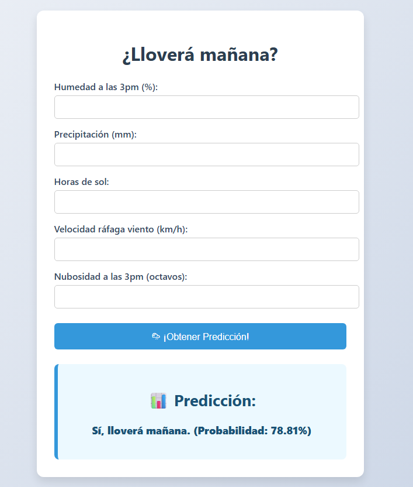

# 🌧️ Predicción de Lluvia en Australia con Machine Learning

Este proyecto aplica técnicas de aprendizaje automático para predecir si lloverá mañana en distintas ciudades de Australia. Combina un modelo de clasificación con una interfaz web construida en Flask, ideal para presentaciones educativas, prototipos o demostraciones personales.

---

## 📊 Dataset

Se utilizó el dataset ["WeatherAUS"](https://www.kaggle.com/datasets/trisha2094/weatheraus) de Kaggle, que contiene datos meteorológicos históricos de varias estaciones en Australia. Incluye variables como temperatura, humedad, nubosidad, velocidad del viento y precipitaciones.

---

## 🧠 Selección de Variables

Durante la fase de exploración y entrenamiento, se usó un modelo **Random Forest** para identificar las variables más influyentes. A partir del análisis de `feature_importances_`, se eligieron las siguientes 5 variables clave:

- `Humidity3pm`
- `Rainfall`
- `Sunshine`
- `WindGustSpeed`
- `Cloud3pm`

Estas fueron seleccionadas por su alta correlación con la variable objetivo `RainTomorrow`. Esta reducción de dimensionalidad permitió mantener el rendimiento del modelo sin sobreajuste ni complejidad innecesaria.

---

## ⚙️ Tecnologías utilizadas

- Python 3
- Flask
- scikit-learn
- pandas
- HTML + CSS

---

## 🖥️ Interfaz Web

La aplicación cuenta con una interfaz web simple y clara. El usuario puede ingresar las variables meteorológicas y obtener una predicción con probabilidad:



---

## 📁 Estructura del proyecto

```

├── app.py
├── models/
│   └── modelo\_rf.pkl
├── templates/
│   └── index.html
├── static/
│   └── styles.css
├── requirements.txt
├── .gitignore
├── README.md
└── screenshot.png

````

---

## 🚀 ¿Cómo correr la app?

1. Clona este repositorio:
   ```bash
   git clone https://github.com/alex-msu/rain-predictor-webapp.git
   cd rain-predictor-webapp

2. Crea un entorno virtual (opcional pero recomendado):

   ```bash
   python -m venv venv
   venv\Scripts\activate  # En Windows
   ```

3. Instala las dependencias:

   ```bash
   pip install -r requirements.txt
   ```

4. Ejecuta la app:

   ```bash
   python app.py
   ```

5. Abre tu navegador y visita:

   ```
   http://localhost:5000
   ```

> ⚠️ **Este repositorio utiliza [Git LFS](https://git-lfs.github.com/)** para almacenar el modelo entrenado (`modelo_rf.pkl`).
> Si vas a clonar este repositorio, asegúrate de tener Git LFS instalado y ejecuta:
>
> ```bash
> git lfs install
> git lfs pull
> ```

---

## 📄 Licencia

Este proyecto está bajo la licencia MIT.

---

## 👤 Autores

Proyecto individual desarrollado por Alexis Martínez, Benjamín Briceño y Joaquín Parada como parte de un curso universitario. Se utilizó aprendizaje automático, ingeniería de características y una API web ligera para la predicción meteorológica.
